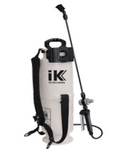

--- 
title: Manual para el Rociado Residual Intradomiciliario de los Artrópodos con Importancia en Salud Pública en México
author: Felipe Antonio Dzul Manzanilla
date: "2021: Last compiled `r Sys.Date()`"
site: bookdown::bookdown_site
output: bookdown::gitbook
documentclass: book
biblio-style: apalike
link-citations: yes
github-repo: fdzul/manual_irs
cover-image: imagenes/cover.jpg
url: https://fdzul.github.io/manual_irs/
favicon: "favicon.ico"
description: "El manual describe el Rociado Residual Intradomiciliario para el control de plagas úrbanas en México"
---

# **** {-}

 
Este documento es la versión en línea del bookdown **Manual del rociado intradomiciliario para el control de plagas úrbanas en México**, es un libro diseñado para desarrollar las competencias específicas para implementar un rociado intradomiciliario con calidad y una impregnación homogénea de la superficie blanco.

  

La publicación online es inspirada por las iniciativas libres para la publicación de libros como 
[**bookdown**](https://github.com/rstudio/bookdown) & todas las inciciativas de software libre para el análisis de datos espaciales y no espaciales como [**R**](https://cran.r-project.org/), [**RStudio**](https://www.rstudio.com/) y [**Python**](https://www.python.org/). El libro es de código abierto, asegurando que su contenido es completamente reproducible y públicamente disponible para personal de las instituciones públicas y privadas de México y el resto del mundo.

La versión online del manual es mantenida en [fdzul.github.io/manual_irs_chilpancingo](https://fdzul.github.io/manual_irs_chilpancingo/) & es actualizada [GitHub Actions](https://github.com/fdzul/manual_irs/actions), la cual proporciona información sobre el estatus 'build status' con:
 

 

**Note**: El manual no ha sido publicado en físico por ninguna editorial y los autores están de acuerdo en llegar a un trato con una editorial.

# **Prologo**{-}

 

# **Justificación**{-}

 

El rociado residual intradomiciliario (RRI) fue desarollado para el control de la malaria y se usó con éxito para la erradicación de la fiebre amarilla en Mexico. La mayoría de los manuales de RRI publicados por la Organización Mundial de la Salud son para el control de los anofelinos, y salvo raras excepciones son para el control de vectores de la leishmaniasis. Recientemente (2019), la Organización Panamericana de la Salud publicó el manual para el control de ***Aedes*** en áreas urbanas. Sin embargo el rociado residual aplica para más artrópodos con importancia en salud pública como pulgas, chinches, garrapatas, alacranes y arañas.

La falta de manuales de rociado residual intradomiciliario para pulgas, chinches, garrapatas, alacranes y arañas constituye un área de oportunidad para generar documentos normativos que permitan integrarse a el portafolio de intervenciones en salud pública enfocado a artrópodos con importancia médica.

# **Estructura de Manual**{-}

 

 

# **Agradecimientos**{-}

 

 El presente manual fue producido por personal de vectores y la Subdirección de Salud Publica de la [Secretaría de Salud del Estado de Veracruz](https://www.ssaver.gob.mx/) en colaboración con la Subdirección del Programa Nacional de Vectores del [Centro de Nacional de Programas Preventivos y Control de Enfermedades](https://www.gob.mx/salud/cenaprece), el Laboratorio de Entomología del [Instituto de Diagnóstico y Referencia Epidemiológicos](https://www.gob.mx/salud/acciones-y-programas/instituto-de-diagnostico-y-referencia-epidemiologicos-indre) de la [Secretaría de Salud Federal](https://www.gob.mx/salud) y la [Dirección de Salud del Municipio de Chilpancingo]().

 Los autores agradecen a la [Secretaría de Salud del Estado de Veracruz](https://www.ssaver.gob.mx/), al [Centro de Nacional de Programas Preventivos y Control de Enfermedades](https://www.gob.mx/salud/cenaprece) y el [Instituto de Diagnóstico y Referencia Epidemiológicos](https://www.gob.mx/salud/acciones-y-programas/instituto-de-diagnostico-y-referencia-epidemiologicos-indre) de la [Secretaría de Salud Federal](https://www.gob.mx/salud) por las facilidades otorgadas para poder desarrollar la presente iniciativa. 

### Autores y coautores {.unnumbered} 

Editor: Felipe Antonio Dzul Manzanilla

Autores & Coautores: Felipe Antonio Dzul Manzanilla, Fabián Corre-Morales, Evaristo Morales-Ríos, Heron Huerta & Cipriano Gutiérrez-Castro. 

### Financiamiento {.unnumbered} 

El Municipio de Chilpancingo contribuyó parcialmente el financiamiento de la elaboración y edición del presente manual.

# **Terminos de uso & Contributiones**{-}
 

### Licencia {.unnumbered} 

 Este obra está bajo una <a rel="license" href="http://creativecommons.org/licenses/by-sa/4.0/">licencia de Creative Commons Reconocimiento-CompartirIgual 4.0 Internacional</a>..

Los programas académicos, cursos y adiestramientos de las instituciones públicas o privadas son bienvenidos a usar este libro, solo notifiquenos por correo para tener conocimiento. email **felipe.dzul.m@gmail.com**.  

### Como citar el trabajo {.unnumbered}

### Contribuciones {.unnumbered}  

Cualquier contribución es bienvenida, por favor de contactarnos vía Github o email.

Nota. el manual de rociado residual intradomiciliario  fue liberado con un código de conducta [Contributor Code of Conduct](https://contributor-covenant.org/version/2/0/CODE_OF_CONDUCT.html).

